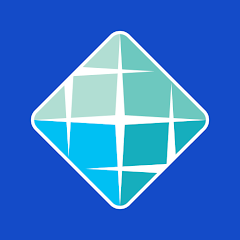

<link rel="stylesheet" href="https://cdn.jsdelivr.net/gh/devicons/devicon@v2.15.1/devicon.min.css">

## Hello, everyone!! 👋
### Hi, my name is Guilherme, welcome to my GitHub profile. 

- 🔰 I'm from Boa Vista - RR, Brasil
- ⚡ I like games, tecnology and I love listenig to music and playing sports
- 💼 I'm currently unemployed and looking for an internship in the IT field
- 🎓 Software Engineering
##

#### Learning in the moment:

##

#### Tools I use:

##

#### Contact me:

##

#### Academic education:
In the overview below you will find my academic background:

**Software Engineering** \
[**Estácio**](https://estacio.br/) \
06/2024 - At the moment.
 
 

Please, contact me on [LinkedIn](https://www.linkedin.com/in/gui-tupinamba/) for a more detailed description of my work experience, education and certification.

##

